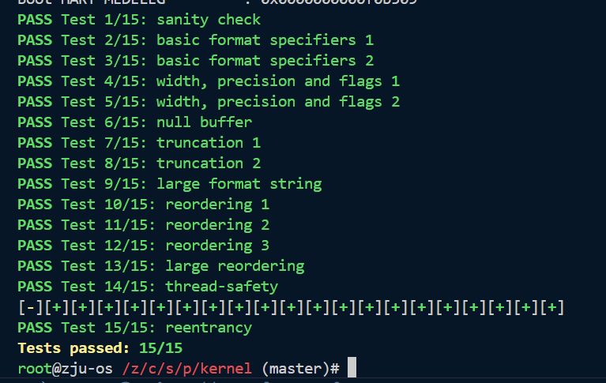

# Bonus 实验报告

## 1 实验目的
1. 理解标准库实现：深入剖析 printf 族函数的内部机制，特别是 vfprintf 如何解析格式化字符串并进行输出。
2. 掌握流的抽象：学习如何利用 FILE 结构体和函数指针的抽象机制，自定义 write 接口，从而将输出流从默认的终端（UART）重定向到内存缓冲区。
3. 深化系统概念：通过实现过程和思考题，加深对可变参数列表（va_list）、线程安全、可重入性、阻塞与非阻塞 I/O 以及 GCC 编译器属性（__attribute__）等系统编程核心概念的理解。

## 2 试验过程
最终输出：

## 3 思考题
bonus被换掉了，不知道写思考题还有没有用，就不写了qaq

## 4 心得体会
虽然今天助教说bonus换了，但是我看还可以交，希望可以拿一点分:)