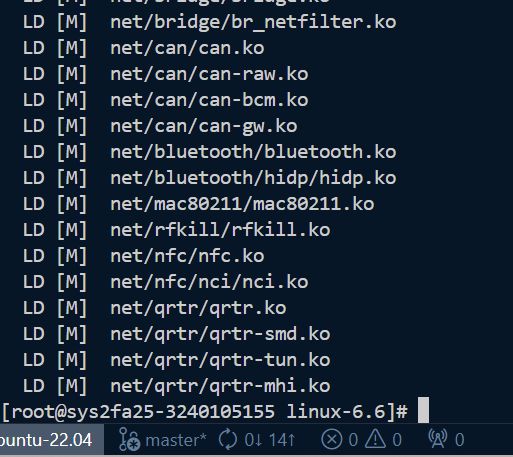
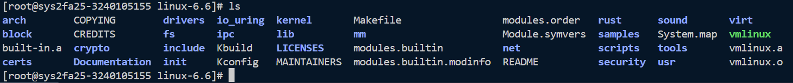
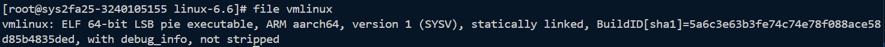
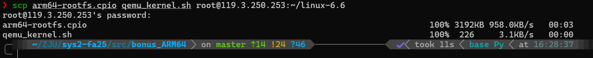
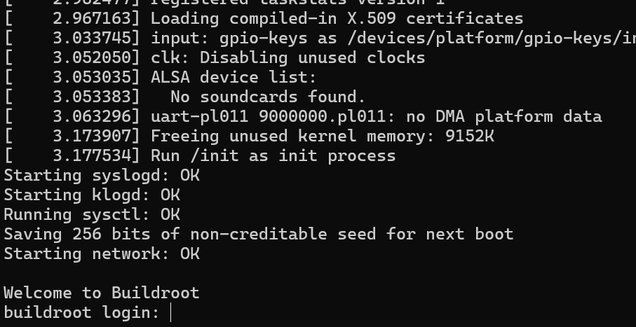
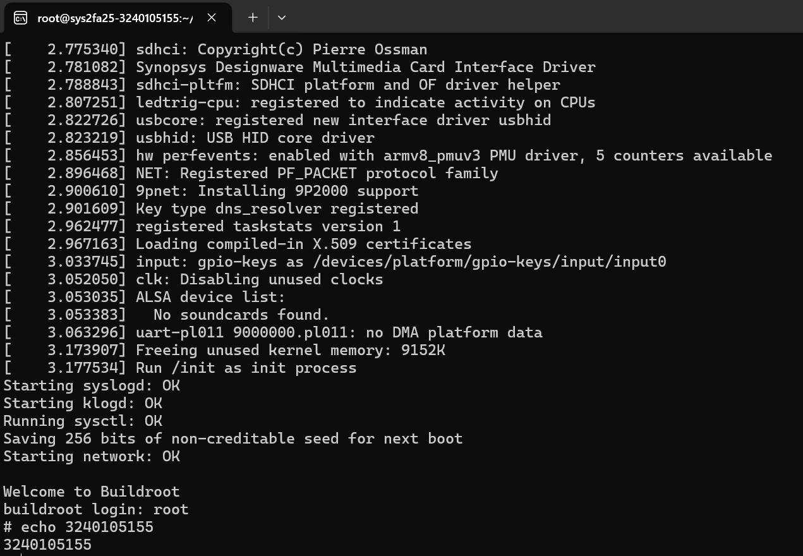
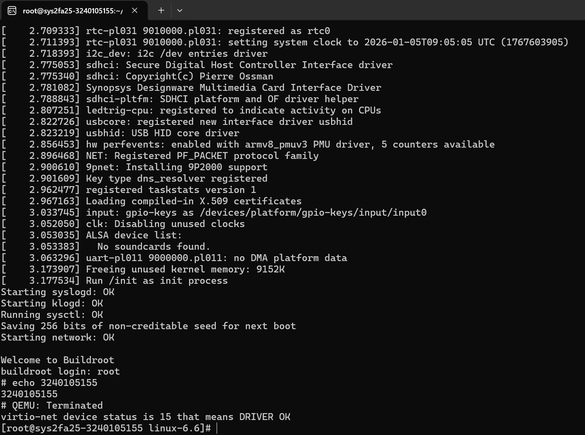

# Bonus-ARM64 实验报告

## 1 实验目的
了解并体验ARM 架构下 Linux 内核的编译与 QEMU 仿真。

## 2 试验过程
1. Linux 内核编译：
    - 编译完成：
    - 执行`ls`：
    - 执行`file vmlinux`：
2. QEMU 内核仿真：
    - 传输文件：
    - 运行 QEMU 启动脚本：
    - 打印学号：
    - 快捷键退出：

实验中遇到的主要问题是安装依赖时，执行`dnf install -y qemu-system-aarch64`命令报错，提示找不到包。尝试了很多方法，最终改为使用`yum`源自动查找。
```bash
# 临时添加 openEuler 源
cat <<EOF > /etc/yum.repos.d/openeuler_temp.repo
[openeuler_temp]
name=openEuler_temp
baseurl=https://repo.huaweicloud.com/openeuler/openEuler-22.03-LTS-SP3/everything/aarch64/
enabled=1
gpgcheck=0
EOF
```

## 3 思考题
无。

## 4 心得体会
由于lab7验收失败，我决定自费做bonus。。。qaq