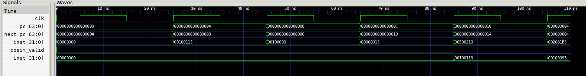
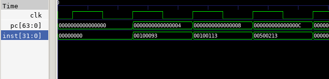
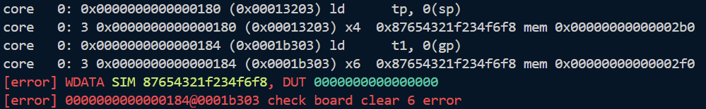

# Lab 1 实验报告

## 1 实验目的
理解流水线的基本思想，基于已经实现的单周期cpu实现一个5级流水线cpu。

## 2 实验过程 
- **问题 1**：在实现中间段寄存器的时候，接口过多导致写起来很麻烦而且代码冗长。
  **解决方案**：使用`core_struct.vh`中定义的结构体来简化接口的定义与传递。

- **问题 2**：第一个周期inst取到的指令是高32位，第二个周期才是低32位，导致取指错误。
  **解决方案**：
  我最开始inst的选取方式是`assign inst = (pc[2]) ? imem_ift.r_reply_bits.rdata[63:32] : imem_ift.r_reply_bits.rdata[31:0];`，和上学期做project时一样（而且本来就应该这样取），但是本实验中发现这样取是反的。所以修改为`assign inst = (pc[2]) ? imem_ift.r_reply_bits.rdata[31:0]  : imem_ift.r_reply_bits.rdata[63:32];`，就能正确取到指令了。
  修改前：
  
  修改后：
  
  我仔细分析了原因：在rst为高电平的那一个周期(记为N)pc为0，`imem_ift.r_reply_bits.rdata`在这个周期还没有准备好（为0），因此inst的取值也为0.到了下一个周期N+1，`imem_ift.r_reply_bits.rdata`根据上一个周期pc=0取到了指令0010011300100093，但是在这个周期pc已经变为4，所以按照常规取法，inst取到的是高位00100113，但是实际上应该取低位000100093。这样inst和pc就会错开一个周期。我这样颠倒取值可以刚好抵消这一个周期的偏差。更加常规的做法可能是再定义一个寄存器将if阶段的pc延迟一个周期，rdata根据原始pc取值，inst根据延迟后的pc取值。


- **问题 3**：在进行跳转指令（beq）时pc不正确。
  **解决方案**：
  查看波形发现跳转指令使使flush为1，导致valid变为0。而我原本的midreg中设置的是当`reg_in.valid==1`时才`reg_out <= reg_in`，这样就会导致之后的中间段寄存器无法存储更新后的信号，导致pc的更新停滞。
  
  修改如下：
  ```systemverilog
    end else if(reg_in.valid) begin
      reg_out_tmp <= reg_in;
    end

  修改为：
    end else begin
      reg_out_tmp <= reg_in;
    end
  ```
  这样valid信号只会用于告诉测试程序当前指令是否有效，而不会影响中间段寄存器的更新。

- **问题 4**：在遇到连续的lb指令时，第二条指令的wdata会被置为0。

  **解决方案**：这两条ld指令分别从sp(0x2b0), gp(0x2f0)地址处取数据，sp处存的数据是给定的已经写好的，取数据也能正常进行，但是gp处存的数据是0，说明在执行test2时对gp地址处写入数据出错。最后排查出来是`DataPkg`和`MaskGen`模块中对`mem_op`和`dmem_waddr`的使用错误，应该使用ex阶段的信号而不是mem阶段的信号。修改后如下：

```systemverilog
   DataPkg data_pkg (
        .mem_op(id_ex_reg_out.mem_op),        // <--- use signal from EX stage
        .reg_data(id_ex_reg_out.reg_data_2),  // <--- use signal from EX stage
        .dmem_waddr(alu_res_ex),              // <--- use signal from EX stage  
        .dmem_wdata(dmem_wdata_mem)
    );

    MaskGen mask_gen(
        .mem_op(id_ex_reg_out.mem_op),        // <--- use signal from EX stage
        .dmem_waddr(alu_res_ex),              // <--- use signal from EX stage
        .dmem_wmask(dmem_wmask_mem)
    );

    DataTrunc trunc(
        .dmem_rdata(dmem_rdata_mem),
        .mem_op(ex_mem_reg_out.mem_op),
        .dmem_raddr(ex_mem_reg_out.alu_res),
        .read_data(mem_rdata_trunc_mem)
    );
````


## 3 思考题

**1. 对于 `syn.asm` 的 `fibonacci` 的如下代码段，请计算该 loop 在流水线 CPU、SCPU、多周期 CPU 各自的 CPI，对比三者的 CPI。**

- **流水线CPU**：
总指令数为16，执行这16条指令需要16个周期，但是由于bne指令会引起if和id阶段的flush，造成两个周期的延迟，因此总共花费18个周期。
$$
CPI_{Pipeline} = \frac{18}{16} = 1.125
$$

- **SCPU**：
对于单周期cpu，每条指令都在一个周期内完成，因此
$$
CPI_{SCPU} = 1
$$

- **多周期CPU**：
多周期cpu将每条指令分成若干个阶段，每个阶段用一个周期来完成。对于给定的代码段：
R-Type：3个add指令，每个需要4个周期（IF，ID，EX，WB），共12个周期。
I-Type：12个addi指令，每个需要4个周期（IF，ID，EX，WB），共48个周期。
Branch：1个bne指令，需要3个周期（IF，ID，EX），共3个周期。
总指令数为16条，因此
$$
CPI_{MCPU} = \frac{12 + 48 + 3}{16} = 3.9375
$$


**2. 假设 SCPU 的时钟频率是 100 MHz，如果流水线想要有比单周期 CPU 更高的执行效率，它的时钟频率至少需要是多少？**
假设流水线CPU的CPI就是上一题计算的1.125，即
$$
CPI_{Pipeline} = 1.125
$$
单周期CPU的CPI为1，因此流水线CPU的时钟频率需要满足
$$
\frac{CPI_{Pipeline}}{f_{Pipeline}} < \frac{CPI_{SCPU}}{f_{SCPU}}
$$
代入
$$
\frac{1.125}{f_{Pipeline}} < \frac{1}{100MHz}
$$
解得
$$
f_{Pipeline} > 112.5MHz
$$

**3. 从时钟频率和 CPI 的角度解释，为什么多周期 CPU 优于单周期 CPU，流水线 CPU 优于多周期 CPU。**
比较不同类型的CPU的性能可以比较最终的执行时间：
$$
执行时间 = \frac{指令数 \times CPI}{时钟频率}
$$
假设指令数都是一样的，我们只需要比较三种CPU的CPI和时钟频率。

**MSPU vs SCPU:**
- **时钟频率：**
单周期cpu的时钟周期由最慢的指令决定，而且每条指令都会耗费一个周期，因此时钟周期长，时钟频率低。
而多周期cpu的时钟周期仅由耗时最长的一个阶段决定，远小于单周期cpu，因此多周期cpu的时钟周期更短，时钟频率更高。
- **CPI：**
虽然多周期cpu的CPI大于单周期CPU，但是由于多周期CPU的时钟频率远高于单周期cpu，因此综合执行时间更短。

**Pipeline vs MSPU:**
- **时钟频率：**
流水线和多周期cpu的时钟周期都由最慢的阶段决定，因此两者的时钟频率相近。
- **CPI：**
流水线cpu的CPI接近1，而多周期cpu的CPI远大于1，因此流水线cpu的执行时间更短。


## 4 心得体会
真难啊，感觉第一个周期处理起来就有点棘手，实验的trick也造成了一定困难。而且实验指导里并没有说要把文件迁移到project目录下，所以最开始找不到makefile文件。还有就是testbench里cosim_wdata写成了date，看着有点难受，但是这个接口好像连到了很多地方，改起来还有点麻烦。