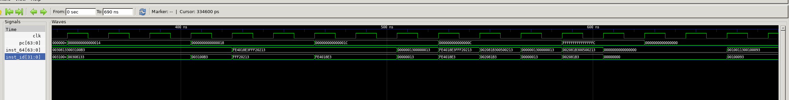
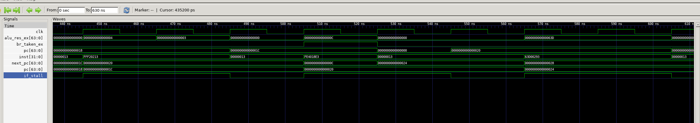
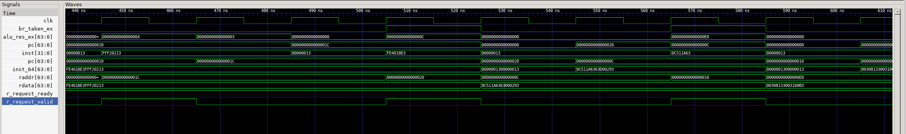
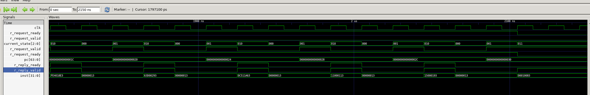
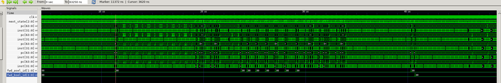
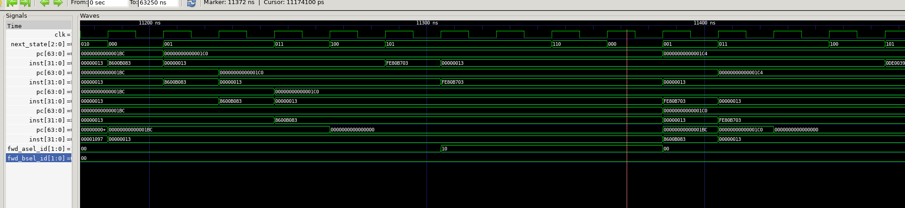

# Lab 2 实验报告

## 1 实验目的

在这个实验中，我学习了如何通过Forwarding和Stall两种手段解决流水线中的数据竞争问题，并且理解了AXI总线的工作原理以及如何通过AXI状态机对总线进行指令和数据的访问。

-----

## 2 试验过程

- **问题 1**：由于pc更新和rdata更新存在延迟，两条指令中间出现无效inst，导致bne指令出错

  **解决方案**：
  在进行bne后，无效inst恰好又是bne指令，导致pc跳转错误。解决这个问题的核心要点就是如何精准定位inst有效的那个周期。观察波形图可以发现当且仅当在这个very cycle，`imem_ift.r_reply_valid & imem_ift.r_reply_ready`为1，因此我的做法是将inst的赋值语句改为：
  ```systemverilog
  assign inst = (imem_ift.r_reply_valid & imem_ift.r_reply_ready) ? 
                ((pc[2]) ? imem_ift.r_reply_bits.rdata[63:32] : imem_ift.r_reply_bits.rdata[31:0]) :
                32'h00000013;
  ```
  这样当pc更新但rdata未更新时，inst_id就会被赋值为nop指令，从而避免了错误的发生。

- **问题 2**：当遇到bne指令时pc跳转错误
  **解决方案**：在我原本的设计中没有正确处理停顿和跳转的优先级，停顿优先级更高：
  ```systemverilog
  always_ff @(posedge clk) begin
        if (rst) begin
            pc <= 64'b0;
        end else if (imem_ift.r_reply_bits.rdata == 64'b0) begin
            pc <= 64'b0; // delay 1 cycle to fetch instruction
        end else if(~stall && ~if_stall && ~mem_stall) begin
            pc <= next_pc; // Normal PC increment
        end
    end

  assign next_pc = br_taken_ex ? alu_res_ex : (pc + 4);
  ```
  这样的话，当需要获取新的指令时，AXI状态机进入`IF1`、`IF2`状态，if_stall=1，导致pc不会更新为next_pc，从而跳转失败。
  
  如图跳转地址为`next_pc=0x0c`，但由于`if_stall=1`pc错过了这个地址。
  解决方案是将跳转的优先级提高：
  ```systemverilog
  always_ff @(posedge clk) begin
        if (rst) begin
            pc <= 64'b0;
        end else if (imem_ift.r_reply_bits.rdata == 64'b0) begin
            pc <= 64'b0; // delay 1 cycle to fetch instruction
        end else if (br_taken_ex) begin
            pc <= alu_res_ex; // Branch taken from EX stage
        end else if(~stall && ~if_stall && ~mem_stall) begin
            pc <= pc + 4; // Normal PC increment
        end
    end
  ```

- **问题 3**：执行bne指令时，pc正确但inst错误
  **解决方案**：
  
观察波形我发现，在pc更新为正确的跳转指令0x0c之前，会先短暂的更新为0x20也就是pc+4，这条错误指令导致取出的指令错误。
在我原先的设计中，br_taken_ex信号没有控制AXI状态机，需要在状态跳转逻辑中添加br_taken_ex的控制：
```systemverilog
always_ff @(posedge clk) begin
        if (rst) begin
            current_state <= IDLE;
        end else if (br_taken_ex) begin
            current_state <= IDLE;  //<---添加控制
        end else begin
            current_state <= next_state;
        end
    end
```
但是由于状态机是时序逻辑，因此在br_taken_ex信号拉高的那个cycle，状态机仍然会继续执行当前状态，导致错误指令被取出。为了解决这个问题，我在imem_ift.r_request_valid的赋值语句中添加了br_taken_ex的控制：
```systemverilog
assign imem_ift.r_request_valid = ((current_state == IF1) || (current_state == WAITFOR1)) && ~br_taken_ex;
```
这样当分支跳转发生时，立即取消当前的取指请求，从而避免了错误指令的取出。

- **问题4**：在执行lb指令时发生死锁，axi状态机进入`WAITFOR1`后`imem_ift.r_request_ready=0`导致状态无法转移到`WAITFOR2`

  **解决方案**：使`WAITFOR1`状态下也发出`imem_ift.r_reply_ready=1`信号，从而让AXI总线能够及时响应读请求：
  ```systemverilog
  assign imem_ift.r_reply_ready = (current_state == IF2) || (current_state == WAITFOR2) || (current_state == WAITFOR1);
  ```

- **问题5**：由于内存操作是通过AXI总线完成，状态转移会导致每条指令的每个阶段都会持续三个state（IDLE、IF1、IF2，从波形中看每次取指至少持续五个周期再进行下一次），但是我现在的流水线寄存器固定在每个时钟上升沿更新，导致一条指令经过流水线寄存器向后传递之后，无法和后一条指令在同一时钟周期上重合，导致遇到除了`load-use hazard`之外的数据竞争时（比如连续两个add），`HazardDetector`不会检测到需要前递，只有在有内存操作，需要stall时才会检测到数据竞争，从而发生forwarding。

目前我还不知道这个问题怎样解决，但是目前的设计的确能通过仿真测试，观察波形发现实际上对于`testcase=full`，发生的forwarding非常少（而且全部都是前递mem阶段的数据），几乎所有竞争都是通过stall解决的。



或许这样就是解决方法？理想的Forwarding可能只会在理想内存访问模型下才会实现。在真实的AXI总线模型下，流水线的性能瓶颈更多的是在于内存访问的延迟，而不是数据竞争本身，forwarding只能减少stall的周期数而不是避免stall。

------

## 3 思考题
**1. 分析 `forward` 和 `stall` 两种技术各自的优缺点，可以从 CPI、时钟频率、元器件开销等角度进行分析；**

**Forwarding：**

优点：可以有效减少因为数据竞争导致的停顿，从而降低CPI，提高流水线的吞吐率。
缺点：需要额外的元器件，比如冒险检测控制逻辑和前递数据多路选择器，这会增加设计的复杂性和硬件开销。此外，前递逻辑可能会增加数据路径的延迟，从而降低时钟频率。

**Stalling：**

优点：设计简单，不需要额外的元器件，而且可以解决任何类型的冒险，通用性强。
缺点：需要流水线停顿，从而增加CPI，降低整体性能。

**2. 请你对数据竞争、控制竞争、结构竞争情况进行分析归纳，试着将他们分类列出，我们的 CPU 目前可能碰到哪种竞争，为什么不会碰到其他的竞争？**

**数据竞争：**

当一条指令需要用到前面指令的计算结果，但该结果还没有写回寄存器堆时发生。
分类：

**(1) 写后读（RAW）：** 后一条指令读取的数据以来前一条指令写入的数据。
例如：
```
    add t1, t2, t3 // I1
    add t4, t5, t6 // I2
    add t4, t1, t4 // I3
```
第三条指令需要用到前两条指令写入寄存器的t1和t4。其中I1与I3之间形成EX/MEM Hazard，I2与I3之间形成MEM/WB Hazard。除了这两种情况，还有Load-Use Hazard，比如如下指令序列：
```
    lw  t1, 0(t2)  // I1
    add t3, t1, t4 // I2
```
I2需要用到I1从内存加载到寄存器t1的数据，但由于lw指令的数据在WB阶段才写回寄存器堆，而add指令在ID阶段就需要读取t1，因此会发生数据竞争。

**(2) 读后写（WAR）：** 后一条指令写入的数据依赖于前一条指令读取的数据。

**(3) 写后写（WAW）：** 两条指令试图以错误的顺序写入同一个寄存器。

在本实验的CPU中，只会碰到RAW类型的数据竞争，因为指令是顺序执行的，并且寄存器读取（ID阶段）在写回（WB阶段）之前完成。

**控制竞争：**
当遇到分支跳转指令时，由于分支结果尚未确定，导致后续指令的取指地址不确定，从而引发控制竞争。

例如遇到bne指令时，需要在这条指令进入EX阶段才能判断是否发生分支跳转，而此时IF、ID阶段已经取了两条错误的指令。

在本实验中会遇到控制竞争，解决方法是发生分支跳转时flushIF/ID和ID/EX寄存器，并将pc更新为正确的跳转地址。

**结构竞争：**
当多个指令争夺相同的硬件资源（如ALU、寄存器堆、内存等）时发生。

本实验中会遇到结构竞争，因为使用了AXI内存总线，内存在同一时间只能处理一个读写请求，因此当IF和MEM阶段同时需要访问内存时会发生结构竞争。

**3. 如果数据竞争和控制竞争同时发生应该如何处理呢？**

遇到如下两条指令：
```
add  t0, t1, t2   // I1: 在 EX 阶段
bne  t0, x0, loop // I2: 在 ID 阶段
```
当bne进入ID阶段时，t0的值还没有写回寄存器堆，因此发生数据竞争。同时，由于bne是分支指令，还会引发控制竞争。此时应当先将add指令在EX阶段的结果forward到bne指令的id阶段，从而解决数据竞争。然后再根据这个前递来的结果判断是否发生分支跳转，从而决定跳转地址和是否flush流水线，解决控制竞争。

**4. 过去的实验是不使用 `mem_ift` 总线或者 `axi` 总线的，通过这些实验对总线的实验，你认为总线的引入对实验开发、内存访问、外设管理、代码调试等带来了那些好处和坏处？**

好处：
引入总线后，内存访问变得更加规范和统一，可以方便地进行外设管理和扩展。同时也可以让我们更好地理解真实地内存访问机制，提高设计能力。

坏处：
引入总线后，内存访问变得非常复杂，取指和访存都需要经过AXI状态机的多周期处理，增加设计和调试难度。

------

## 4 心得体会
难死了，真的是整整花了三周时间才做完。而且完全遵循实验指导会使实现难度飙升，可能还是应该根据自己已有的设计灵活调整。