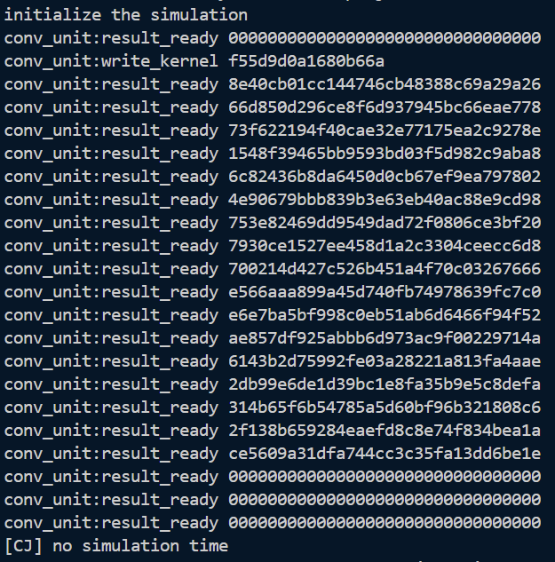
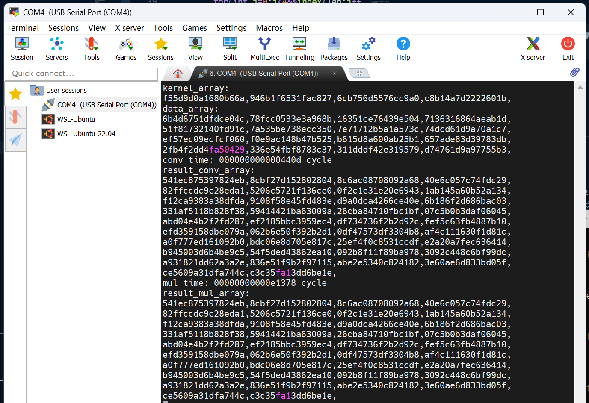

# Lab 3 实验报告

## 1 实验目的
我这个实验通过学习调用硬件卷积加速模块，了解了如何使用MMIO外设。同时通过对比软件实现和硬件实现的性能差异，理解了硬件加速器在计算密集型任务中的优势。

## 2 试验过程

- **问题 1**：在运行`make conv 2>/dev/null`时，输出错误，`write_kernel`只有一行，而且卷积结果不正确。

  **解决方案**：问题出在`conv_kernel_init`函数，在我最开始的实现中，我误以为将不同的卷积核参数写入卷积核参数队列应当写入连续的不同地址，就像数组在内存中一样储存，于是我写成了：
    ```c
    static void conv_kernel_init(const uint64_t* kernel_array, size_t kernel_len){
        for(size_t i=0; i<kernel_len; i++){
            CONV_BASE[CONV_KERNEL_OFFSET + i] = kernel_array[i];
        }
    }
    ```
    但是实际上卷积核参数应该被依次写入同一个地址，硬件会自动将其存入队列中，我那样写会导致只有第一个参数被写入，而剩下的参数被写入了储存其他东西的地址，比如`i==1`时：`CONV_BASE[1] = kernel_array[1]`而刚好有`CONV_DATA_OFFSET == 1`，导致卷积核参数被写进了数据队列，引发计算结果错误。正确的写法应当是：
    ```c
    static void conv_kernel_init(const uint64_t* kernel_array, size_t kernel_len){
        for(size_t i=0; i<kernel_len; i++){
            CONV_BASE[CONV_KERNEL_OFFSET] = kernel_array[i]; <---向同一个地址写入
        }
    }
    ```

- **其他问题**：在下板时遇到软件计算结果部分异常，按照[issue26](https://git.zju.edu.cn/zju-sys/sys2/sys2-fa25/-/issues/26)中的方法可以解决。

这个实验中遇到的问题比较少，那就讲讲实现`mul_compute`函数时的思路吧。
由于当前指令集不支持mul操作，所以在实现乘法时，需要采用移位再相加的方法。具体来讲，对于两个64位整数a和b的乘法，我们可以将b的每一位与a相乘，然后根据该位的位置进行相应的左移，最后将所有结果相加得到最终的乘积。
```c
// Calculate a * b without using *
static void multiply_64to128(uint64_t a, uint64_t b, uint64_t* res_hi, uint64_t* res_lo){
    uint64_t hi = 0, lo = 0;

    for(int i = 0; i < 64; i++){
        if((b >> i) & 1){
            // Add (a << i) to the result
            uint64_t add_lo = a << i;
            uint64_t add_hi = (i==0) ? 0 : (a >> (64 - i)); // upper bits that overflow

            uint64_t new_lo = lo + add_lo;
            uint64_t carry = (new_lo < lo) ? 1 : 0; // check overflow
            uint64_t new_hi = hi + add_hi + carry;

            lo = new_lo;
            hi = new_hi;
        }
    }

    *res_hi = hi;
    *res_lo = lo;
}
```


## 3 思考题

1. **分别给出使用卷积加速器和整数指令执行测试的执行时间，计算得到卷积加速器相对于整数指令的加速比。**

    
    如图所示，卷积加速器执行时间为0x0440d cycles，整数指令执行时间为
    0xe1378 cycles。计算得到加速比为：
    $$
    \frac{e1378}{0440d} = 34
    $$

2. **试分析卷积加速器相对于整数指令运算存在的优缺点，列举卷积加速器可以被使用的实际应用场景。**

    **优点：**

    1. 性能优越：本实验的卷积加速器用脉动阵列实现，在硬件层面实现了并行运算，可以在一个时钟周期内同时进行多次乘法和加法计算，和软件实现`mul_compute`的串行运算相比，吞吐量更高，性能更加优越。

    2. 高能效：卷积运算单元专门用于执行这类运算，它的电路结构比CPU简单得多，执行相同规模的运算所消耗的能源远低于整数指令，同时还可以让CPU从卷积运算中解放出来，去执行其他指令。

    **缺点：**

    1. 功能单一：卷积加速器只适用于执行卷积或类似运算，无法执行其他类型的运算，而整数指令运算的功能共多样，灵活性高。

    2. 设计与制造成本高：在硬件层面实现卷积加速器需要额外的物理面积，在保持高性能的的前提下减小面积需要很高的设计和制造成本。

3. **如何用卷积加速器实现乘法运算？**

    将`kernel_len`和`data_len`设置为1，`data_array`和`kernel_array`中分别填充被乘数（如A）和乘数（如B），就可以得到结果A*B

4. **本实验将对大家卷积加速器的执行时间进行排序，排名高者予以 bonus，大家可以尝试优化自己的流水线实现、软件代码，以期得到更高的执行效率。**

    卷积加速器执行时间：0x0440d cycles


## 4 心得体会
这个实验相比前两个真是温和很多。但是看issue发现有很多问题，比如仿真输出格式不对、内存overflow等等，学长学姐们都贡献了自己的解决方法。但是我觉得每年的实验文档应该根据往年遇到的问题做一些更新，并从更为专业的角度讲讲为什么会出现这个问题，这样更有利于大家对于实验内容的理解。比如这次试验遇到下板输出结果部分异常，按照issue26的解决方案改掉就可以通过，但是我还是不清楚为什么会这样。