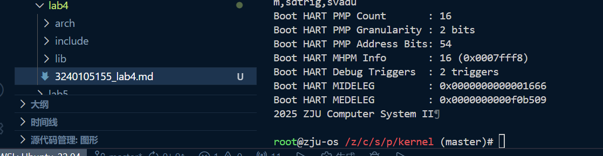
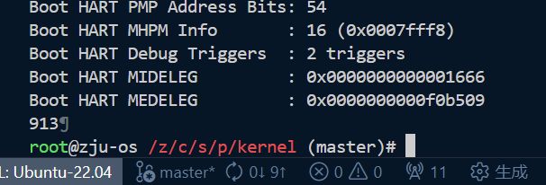

# Lab 4 实验报告

## 1 实验目的

这个实验要求我们学习`makefile`和RISC-V汇编的编写，通过编写一个简单的引导程序来启动内核。
除此之外，我们还需要掌握使用Docker容器来搭建实验环境的技能。

## 2 试验过程

- **问题 1**：编写完`makefile`后，执行`make`命令时，报错`*** missing separator.  Stop.`
  **解决方案**：在`makefile`中，命令行前面必须使用**Tab键**进行缩进，而不是空格键。将报错位置的缩进改为Tab就可以解决问题。

- **问题 2**：执行`make`时报错`Error: illegal operands addi sp,sp,4096'`
  **解决方案**：RISC-V指令`addi`的立即数范围是-2048到2047，而4096超出了这个范围。需要使用两条指令来实现栈指针的调整：
  ```assembly
  li t0, 4096       # 将4096加载到临时寄存器t0中
  add sp, sp, t0    # 将t0的值加到sp上
  ```
  这样就避免了立即数范围的问题。

- **问题 3**：完成所有文件的编写后，执行`make`命令时，报错找不到头文件`sbi.h`和`print.h`。
  **解决方案**：
  我以为上层的makefile会处理include路径的问题，所以在编写子目录的makefile时没有添加头文件搜索路径。

  在`makefile`中添加头文件搜索路径，`CPPFLAGS := -I../include -I../../../include`，这样编译器就能找到头文件了。

最终执行`make run`，成功启动了内核，并在控制台输出了预期的信息：


## 3 思考题

#### 1. 我们的vmlinux文件由哪些文件编译而成？

根据顶层的`Makefile`文件中的规则：
```makefile
  $(LD) -T arch/riscv/kernel/vmlinux.lds arch/riscv/kernel/*.o lib/*.o -o vmlinux
```
可以看出，`vmlinux`是由`arch/riscv/kernel/*.o`和`lib/*.o`文件链接而成的。这些`.o`文件是通过编译`arch/riscv/kernel`目录下的源文件和`lib`目录下的源文件生成的。
包括`arch/riscv/kernel`目录下的`head.S`、`main.c`、`print.c`、`sbi.c`和`lib`目录下的`div.S`、`muldi3.S`。vmlinux.lds作为链接器脚本，定义了最终可执行文件的内存布局。

#### 2. 使用 riscv64-linux-gnu-objdump 反汇编 vmlinux，你发现了什么？

`Makefile`中的规则：
```makefile
  $(OBJDUMP) -S vmlinux > vmlinux.asm
```
将`vmlinux`反汇编成了`vmlinux.asm`文件。通过查看`vmlinux.asm`，可以发现以下要点：
1. 文件中包含了汇编代码和C代码混合的形式，C代码被编译成了对应的汇编指令，包括pc和inst。例如：
```assembly
  uint64_t len = 0;                        <--- C代码
  80200080:	00000613          	li	a2,0   <--- 对应的汇编代码
```

2. 在源码中写的伪指令会被转换为实际的机器指令，例如`head.S`中:
```assembly
  call start_kernel # 调用 start_kernel 函数                  <--- 伪指令(call)
  80200010:	038000ef          	jal	80200048 <start_kernel>  <--- 实际的机器指令
```

3. 可以看见函数参数传递的细节，比如`puts`函数在调用`sbi_ecall`时，参数是如何传递到寄存器中的：
```assembly
  // Call SBI ecall to write string
  sbi_ecall(0x4442434e, 0, len, (uint64_t)s, 0, 0, 0, 0);   <--- C代码
  80200098:	00000893          	li	a7,0                    <--- 参数传递到寄存器a7
  8020009c:	00000813          	li	a6,0
  802000a0:	00000713          	li	a4,0
  802000a4:	00000593          	li	a1,0
  802000a8:	44424537          	lui	a0,0x44424
  802000ac:	34e50513          	addi	a0,a0,846 # 4442434e <_skernel-0x3bddbcb2>
  802000b0:	104000ef          	jal	802001b4 <sbi_ecall>    <--- 传递参数后调用函数
```

4. 每个函数的开头都会建立栈帧，保存返回地址和旧的栈指针，函数结束时恢复栈帧并返回。例如`puts`函数：
```assembly
  80200074:	ff010113          	addi	sp,sp,-16     <--- 建立栈帧
  80200078:	00113423          	sd	ra,8(sp)        <--- 保存返回地址
  ...
  802000b4:	00813083          	ld	ra,8(sp)        <--- 恢复返回地址
```


#### 3. 编译的过程是什么

1. 预处理：处理源代码中的预处理指令，如`#include`和`#define`，生成纯C代码。

2. 编译：将预处理后的C代码编译成汇编代码。

3. 汇编：将汇编代码转换为机器码，生成目标文件（`.o`文件）。

4. 链接：将多个目标文件和库文件链接在一起，生成最终的可执行文件（`vmlinux`）。

#### 4. 编译之后，通过 `System.map` 查看 `vmlinux.lds` 中自定义符号的值，比较它们的地址是否符合你的预期。

  查看`System.map`文件可以发现，`_skernel`的值为0x80200000，符合`vmlinux.lds`中定义的内核起始地址`BASE_ADDR = 0x80200000;`。此外，`_etext`、`_edata`和`_ebss`的地址依次递增，分别对应`.text`、`.data`和`.bss`段的结束地址，符合预期。

#### 5. 在你的第一条指令处添加断点，观察你的程序开始执行时的特权态是多少，中断的开启情况是怎么样的？


  在`head.S`开头插入指令`csrr a0, mstatus`，调试时发现程序卡死，这是因为OpenSBI启动后会将CPU切换到S-mode，而`csrr`指令只能在M-mode下执行，导致非法指令异常。通过这种方式可以确认内核启动时的特权态为S-mode。
  通过查看`mstatus`和`sstatus`寄存器的值也可以确定：
  ```shell
  (gdb) p/x $mstatus
  $1 = 0x8000000a00006900
  (gdb) p/x $sstatus
  $2 = 0x8000000200006100
  ```
  `sstatus`的SSP位（二进制展开后第8位）为1，表示程序在执行第一条指令前的特权态为S-mode。SIE位为0，表示中断在此时是关闭的状态。

#### 6. 在你的第一条指令处添加断点，观察内存中 `.text`、`.data`、`.bss` 段的内容是怎样的？

  1. `.text`段：使用命令`x/10i _stext`得到输出：
  ```assembly
  (gdb) x/10i _stext
  0x80200000 <_stext>: csrr a0,mstatus
  0x80200004 <_stext+4>: auipc sp,0x2
  0x80200008 <_stext+8>: ld sp,4(sp)
  0x8020000c <_stext+12>: lui t0,0x1
  0x80200010 <_stext+16>: add sp,sp,t0
  0x80200014 <_stext+20>: jal 0x8020004c <start_kernel>
  0x80200018 <hang>: j 0x80200018 <hang>
  0x8020001c <ecall_test>: addi sp,sp,-16
  0x80200020 <ecall_test+4>: sd ra,8(sp)
  0x80200024 <ecall_test+8>: li a7,0
  ```
  可以看到`.text`段中存放的是程序的指令代码。

  2. `.data`段：使用命令`x/10x &_sdata`得到输出：
  ```assembly
  (gdb) x/10gx &_sdata
  0x80202000:     0x0000000000000000      0x0000000080203000
  0x80202010:     0xffffffffffffffff      0x0000000000000000
  0x80202020:     0x0000000000000000      0x0000000000000000
  0x80202030:     0x0000000000000000      0x0000000000000000
  0x80202040:     0x0000000000000000      0x0000000000000000
  ```
  可以看到`.data`段中存放的是已初始化的全局变量和静态变量。

  3. `.bss`段：使用命令`x/10gx &_sbss`得到输出：
  ```assembly
  (gdb) x/10gx &_sbss
  0x80203000:     0x0000000000000000      0x0000000000000000
  0x80203010:     0x0000000000000000      0x0000000000000000
  0x80203020:     0x0000000000000000      0x0000000000000000
  0x80203030:     0x0000000000000000      0x0000000000000000
  0x80203040:     0x0000000000000000      0x0000000000000000
  ```
  可以看到`.bss`段中的数据全为0，这是因为BSS段在程序运行前会被清零，用于存放未初始化的全局变量。

#### 7. 观察 `vmlinux.asm` 中 `sbi_ecall` 编译得到的汇编代码。这段代码是如何实现正确地将参数 `arg[0-5]` 放置在寄存器 `a[0-5]` 中的？

  首先将函数传入的参数存放在临时寄存器中：
  ```assembly
  802001c0:	00050e13          	mv	t3,a0
  802001c4:	00058313          	mv	t1,a1
  802001c8:	00060e93          	mv	t4,a2
  802001cc:	00068f13          	mv	t5,a3
  802001d0:	00070f93          	mv	t6,a4
  802001d4:	00078293          	mv	t0,a5
  802001d8:	00080393          	mv	t2,a6
  ```

  然后将临时寄存器中的值按照SBI的规范放置到对应的a寄存器中：
  ```assembly
  802001dc:	00088413          	mv	s0,a7
  802001e0:	000e0893          	mv	a7,t3 # t3中存放着arg0(eid)
  802001e4:	00030813          	mv	a6,t1 # t1中存放着arg1(fid)
  802001e8:	000e8513          	mv	a0,t4
  802001ec:	000f0593          	mv	a1,t5
  802001f0:	000f8613          	mv	a2,t6
  802001f4:	00028693          	mv	a3,t0
  802001f8:	00038713          	mv	a4,t2
  802001fc:	00040793          	mv	a5,s0
  ```
  这样可以避免C函数参数寄存器与SBI调用约定之间的冲突，确保参数正确传递。

#### 8. 尝试从汇编代码中给 C 函数 `start_kernel` 传递参数。
  将`main.c`中的`start_kernel`函数修改为接受一个整数参数：
  ```c
  void start_kernel(int arg) {
    puti(arg);
    ecall_test();
  }
  ```
  然后在`head.S`中调用`start_kernel`时传递参数：
  ```assembly
    li a0, 913       # 传递参数 arg = 913用于测试思考题8
    call start_kernel # 调用 start_kernel 函数
  ```
  重新编译并运行内核，观察输出：
  

#### 9. 了解 C 语言中“有宿主环境”（hosted）和“自立环境”（freestanding）的概念，我们的内核运行在哪种环境下？
  有宿主环境指的是程序运行在操作系统之上，比如我们在linux和windows下运行的普通C程序，这些程序可以使用标准库函数如`printf`、`malloc`等。
  自立环境指的是程序直接运行在硬件上，没有操作系统的支持，比如嵌入式系统和操作系统内核，这些程序通常不能使用标准库函数。

  我们的内核运行在自立环境下，因为它直接运行在硬件上，没有操作系统的支持。此外`Makefile`中指定了`-ffreestanding`选项，表明编译器生成的代码不依赖于宿主环境。

#### 10. 解释为什么RV64中没有idiv指令，但是在我们的c代码中可以使用`/`和`%`
  `Makefile`中指定了`ISA := rv64ia_zicsr_zifencei`，没有包含`M`扩展，因此编译器不会直接生成`/`和`%`操作对应的`idiv`和`irem`指令，而是将这些操作转换为调用库函数（如`_divdi3`）来实现整数除法和取模。
  此外，`LDFLAGS := -lgcc...`告诉链接器链接GCC的内置库，这些库中包含了实现除法和取模的函数。
  在反汇编文件`vmlinux.asm`的末尾也可以看见这些库函数：
  ```assembly
  000000008020026c <__divdi3>:
  #endif

  FUNC_BEGIN (__divdi3)
    bltz  a0, .L10
      8020026c:	06054063          	bltz	a0,802002cc <__umoddi3+0x10>
    bltz  a1, .L11
      80200270:	0605c663          	bltz	a1,802002dc <__umoddi3+0x20>
  ```


## 4 心得体会
软件实验确实比前几个硬件实验简单一些。这个实验让我更好的理解了操作系统引导过程中的细节，比如栈的初始化和跳转到内核入口点的过程。
通过编写`makefile`，我也学会了如何组织和管理多个源文件的编译过程。
