# Lab 5 实验报告

## 1 实验目的
我们在这个实验中学习RISC-V中的trap处理机制，理解并实现上下文切换的过程，掌握时钟中断的处理流程。

## 2 试验过程

#### 问题 1：按照文档完成试验后，无法观察到输出不同步的现象
**解决方案**：实际上是因为运行时间不够长，执行`printk`的累计时间没有超过时钟中断的间隔时间。当运行到第695次时钟中断时，第一次观察到失去同步的现象，这个数值可以验证思考题4中对于`printk`执行时间的估算（1MHz/20250约等于500，基本符合观察到的695）.


## 3 思考题

#### 1. 在实现上下文切换部分，我们需要保存寄存器，谈谈为什么需要保存寄存器和 sepc，其他的特权寄存器则不需要，以及为什么要保存在栈上
1. 为什么要保存寄存器？
    中断处理程序`trap_handler`在执行时需要用到寄存器，并且修改寄存器中的值。如果不保存寄存器的值，处理程序执行完毕后，原来的寄存器值会丢失，导致中断发生前的程序无法正确继续执行。
    - 不保存寄存器的后果：
    1. 将`entry.S`中保存和恢复`t0`的代码注释掉然后重新编译。
    ```asm
    # sd x5, 24(sp)
    ...
    # ld x5, 24(sp)
    ```
    2. 使用gdb调试，分别在`_traps`开始处和`sret`处设置断点，运行程序并观察`t0`寄存器的值。
    ```bash
    (gdb) b _traps
    (gdb) c
    (gdb) i r t0
    (gdb) b *0x000000008020017c
    (gdb) c
    (gdb) i r t0
    ```
    3. 结果显示，执行`trap_handler`时，`t0`寄存器的值会被修改（0x0变为0x802001e4）。
    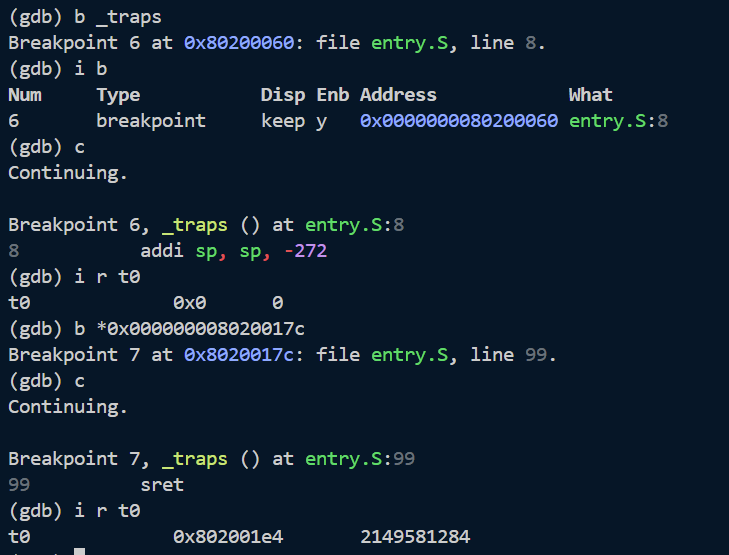
    这个被修改的值可能会影响后续程序的执行，导致程序行为异常。

2. 为什么要保存sepc而其他特权寄存器不需要？
    sepc寄存器记录了中断发生时CPU正在执行的指令的地址，中断处理结束后需要通过sepc恢复程序的执行。如果发生嵌套中断，sepc会被覆盖，因此必须保存。其他特权寄存器在中断处理过程中不会被修改或者是只读的，因此不需要保存。
    - 不保存sepc的后果:
    由于没有发生嵌套中断，按照上面的方法测试并不能观察到问题。
    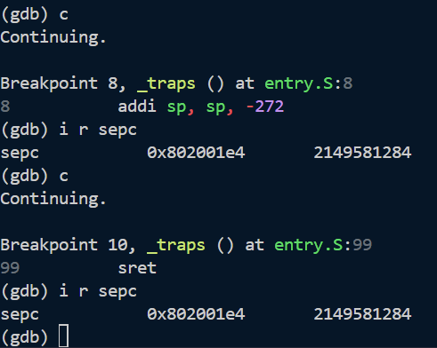
    因此我们需要人为制造嵌套中断的情况来观察不保存sepc的后果。
    ```bash
    (gdb) b _traps
    (gdb) c
    (gdb) i r sepc         <-- 记录正确值
    (gdb) b *0x8020017c    <-- 在 sret 处断点
    (gdb) c
    (gdb) set $sepc = 0    <-- 手动破坏 sepc
    (gdb) si               <-- 执行 sret
    (gdb) p/x $pc          <-- 查看 PC
    (gdb) i r sepc         <-- 查看 sepc
    ```
    结果显示，执行`trap_handler`后，`sepc`寄存器的值会被修改（0x802001f4变为0x0），但是pc的值又回到了`_traps`的入口`0x80200060`。
    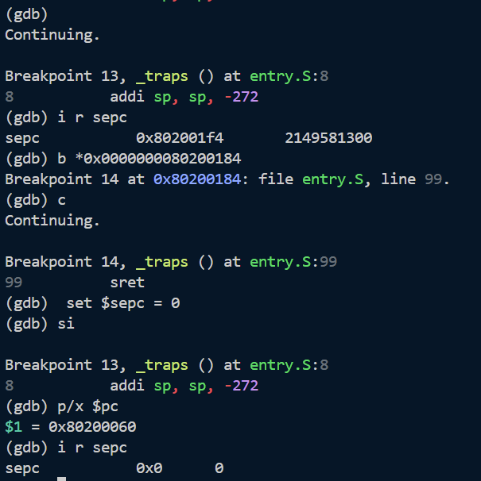
    这是因为将sepc设置为0后，CPU尝试跳转到无效的地址，因此触发了新的异常。
    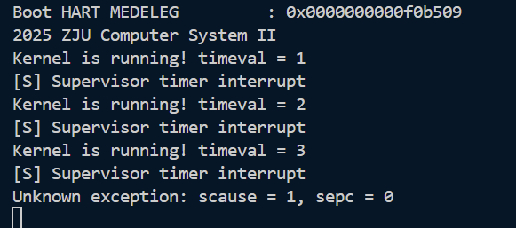
    此时CPU跳转到`stvec`中设置的地址`0x80200060`（在`head.S`中设置），重新进入了`_traps`处理程序。根据我在`trap.c`中的设置，遇到exception会打印错误信息并进入死循环。
    ```c
    ...
    else{
        // 处理异常
        printk("Unknown exception: scause = %lx, sepc = %lx\n", scause, sepc);
        // 死循环
        while(1);
    }
    ```

3. 为什么要保存在栈上？
    栈的LIFO特性适用于函数嵌套调用调用，中断处理程序可能会被嵌套调用，因此使用栈来保存寄存器和sepc是合适的选择。而且每个线程都会有自己的栈，将寄存器保存到栈上可以避免不同线程之间的冲突.


#### 2. 在我们使用 `make run` 时，OpenSBI 会产生如下输出：

```bash
Boot HART MIDELEG         : 0x0000000000001666
Boot HART MEDELEG         : 0x0000000000f0b509
```
查阅 The RISC-V Instruction Set Manual: Volume II - Privileged Architecture，解释**你的** OpenSBI 给出的 `MIDELEG` 和 `MEDELEG` 值的含义。如果实验中 `mideleg` 和 `medeleg` CSR 没有被正确设定，会有什么影响？

我的 OpenSBI 给出的 `MIDELEG` 和 `MEDELEG` 值和上述值相同。
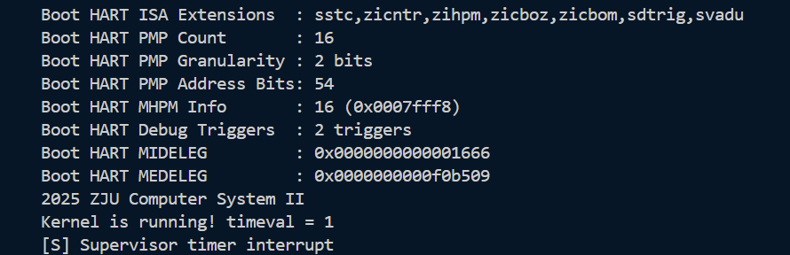
在上述文档的3.1.8节Machine Trap Delegation Registers (medeleg and mideleg)中，有如下描述：
>To increase performance, implementations can provide individual read/write bits within medeleg and mideleg to indicate that certain exceptions and interrupts should be processed directly by a lower privilege level.
>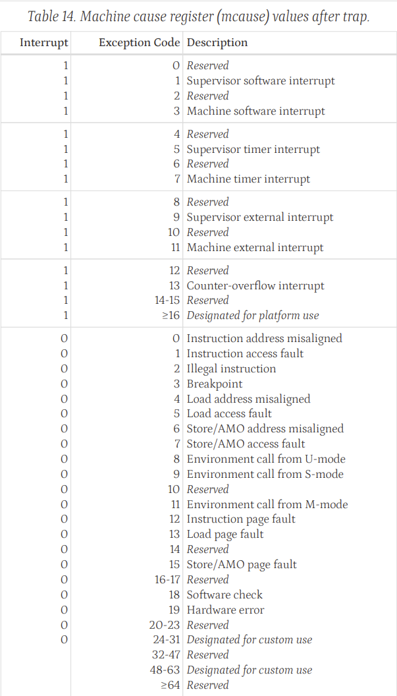

在RISC-V中，`mideleg`和`medeleg`寄存器用于指示哪些中断和异常应该被委托给较低特权级别（如Supervisor模式）处理。每个位对应一种特定的中断或异常类型，如果该位被设置为1，则表示该类型的中断或异常将被委托给较低特权级别处理。
查表可知：
- `Boot HART MIDELEG : 0x0000000000001666`二进制值位`... 0001 0110 0110 0110`，表示以下中断被委托给Supervisor模式处理：
    - Supervisor Software Interrupt (bit 1)
    - Supervisor Timer Interrupt (bit 5)
    - Supervisor External Interrupt (bit 9)
    - bit 2、6、10、12是保留位（Reserved）
- `Boot HART MEDELEG : 0x0000000000f0b509`二进制值位`... 1111 0000 1011 0101 0000 1001`，表示以下异常被委托给Supervisor模式处理：
    - Instruction Address Misaligned (bit 0)
    - Breakpoint (bit 3)
    - Environment Call from U-mode (bit 8)
    - Instruction Page Fault (bit 12)
    - Load Page Fault (bit 13)
    - Store/AMO Page Fault (bit 15)
    - bit 10、20-23是保留位（Reserved）


#### 3. 如何在不支持 M 扩展的处理器上执行 M 扩展指令？
参考The RISC-V Instruction Set Manual: Volume I - Unprivileged Architecture 第 1.2 节中的下面一段话：
>The implementation of a RISC-V execution environment can be pure hardware, pure software, or a combination of hardware and software. For example, opcode traps and software emulation can be used to implement functionality not provided in hardware.

RISC-V的执行环境可以是硬件与软件的组合。要想在不支持M扩展的处理器（hardware）上执行M扩展指令，可以通过软件模拟的方式来实现。具体来说，当处理器遇到M扩展指令时，可以触发一个异常（opcode trap），然后由操作系统或运行时环境捕获这个异常，并通过软件模拟的方式（用基础整数指令模拟乘除运算）来执行该指令的功能。这种方法允许在不具备硬件支持的情况下，仍然能够执行M扩展指令。


#### 4. 如果是完全按照我们的实验指导实现的，那么在运行一段时间后，你应当会看到 `test` 函数的输出和时钟中断的输出出现失去同步的情况：
```bash
[S] Supervisor timer interrupt
Kernel is running! timeval = 195
[S] Supervisor timer interrupt
Kernel is running! timeval = 196
Kernel is running! timeval = 197
[S] Supervisor timer interrupt
Kernel is running! timeval = 198
[S] Supervisor timer interrupt
```

请分析这种现象的原因，问题出在 `test` 函数还是时钟中断上？请通过gdb调试截图来说明问题。请修改代码，来保持两者的同步
tips：请备份修改前的代码，这个修改在完成思考题5之后可以复原，便于后续实验的进行

我的程序在运行到第695次时钟中断时，出现了失去同步的情况。
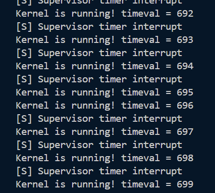
问题出现在`clock.c`时钟中断的设置方式上。在`clock_set_next_event`函数中，我们通过以下代码设置下一个时钟中断：
```c
asm volatile("rdtime %0" : "=r"(time)); // 获取当前时间
uint64_t next = time + TIMECLOCK;       // 下一次 = 当前 + 间隔
sbi_set_timer(next);
```
这里我们每次都从`rdtime`获取当前时间，然后加上一个固定的间隔`TIMECLOCK`来设置下一个中断时间。然而，由于`printk`函数的输出需要一定的时间，如果`printk`的累计的执行时间超过了`TIMECLOCK`，就会导致`test`函数的输出和时钟中断的输出失去同步。
- GDB调试：在`clock_set_next_event`函数入口处设置断点，观察连续两次中断之间的时间差。
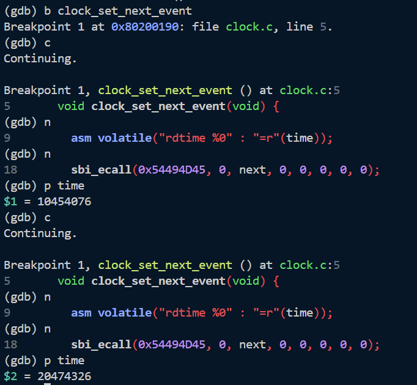
可以看到，连续两次中断之间的时间差$20474326-10454076=10020250$大于`TIMECLOCK`，产生了时间为20250的延迟，这个延迟在循环中不断累积，最终导致了失去同步的现象。

为了解决这个问题，我们可以修改`clock_set_next_event`函数，使其基于上一次中断的时间来计算下一次中断时间，而不是每次都从当前时间开始计算。修改后的代码如下：
```c
static uint64_t last_time = 0; // 记录上一次中断时间
void clock_set_next_event() {
    uint64_t time;
    if (last_time == 0) {
        asm volatile("rdtime %0" : "=r"(time)); // 获取当前时间
        last_time = time;
    }
    last_time += TIMECLOCK;       // 下一次 = 上一次 + 间隔
    sbi_ecall(0x54494D45, 0, last_time, 0, 0, 0, 0, 0);
}
```

修改后再次进行gdb调试，发现连续两次中断的时间差30403032-20403032等于`TIMECLOCK`，成功保持了同步。
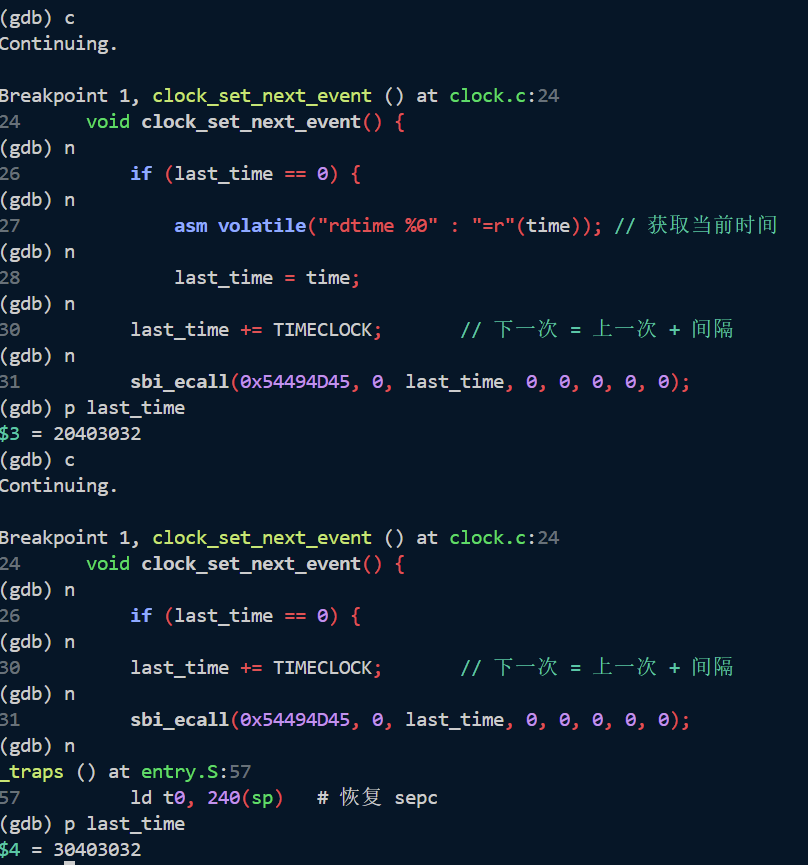


#### 5. 请自行设计方案，测试 `test` 函数中的 `printk` 输出信息需要的时间。假定时钟频率为 10 MHz，在确保每次 `timeval` 变化时，信息都能被完整输出的情况下，每秒最多可以发生多少次时钟中断？请尝试修改 `TIMECLOCK` 和其他可能需要修改的地方，验证这个值。只需近似计算即可。

- 设计方案：
在`test`函数中，我们可以在每次执行`printk`前后使用`rdtime`指令获取时间戳，然后计算两次时间戳的差值来估算`printk`函数的执行时间。具体实现如下：
```c
asm volatile("rdtime %0" : "=r"(start));
printk("Kernel is running! timeval = %" PRIu64 "\n", timeval);
asm volatile("rdtime %0" : "=r"(end));
printk("printk took %" PRIu64 " cycles\n", end - start);
```
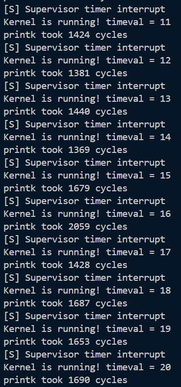
- 计算`printk`需要时间：
取第11-20次输出的平均值，`printk`函数的平均执行时间约为
$$
T = \frac{\sum_{i=11}^{20}cost_i}{10} = 1581.0 \text{ cycles}
$$

- 计算最大时钟中断频率：
为了确保信息能被完整输出，需要每次中断的间隔时间大于等于`printk`的执行时间
最小间隔为$T_{min} = 2 \times T = 3162.0$ cycles
最大频率为$f_{max} = \frac{10 \text{ MHz}}{T_{min}} \approx 3162.6$ Hz

- 验证：
将`TIMECLOCK`设置为2500（小于`printk`执行时间），运行程序，发现输出信息出现了丢失，只能看到`[S] Supervisor timer interrupt`，无法看到`Kernel is running! timeval = ...`的信息。这说明CPU时间完全用于处理中断，没有执行`test`。
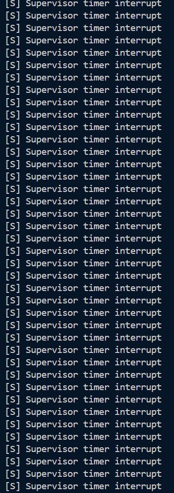

将`TIMECLOCK`设置为4000（大于`printk`执行时间），运行程序，发现可以看得到`Kernel is running! timeval = ...`的信息，说明`test`函数有机会执行，验证了计算的最大频率大致正确。
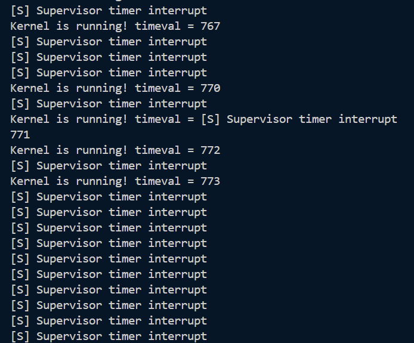


## 4 心得体会
思考题很有分量。