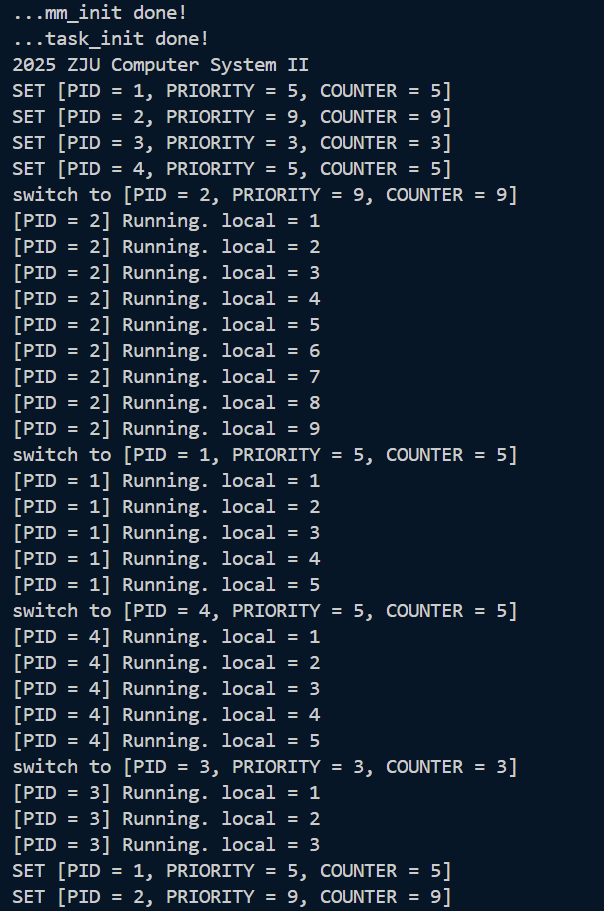
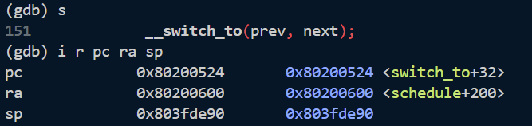
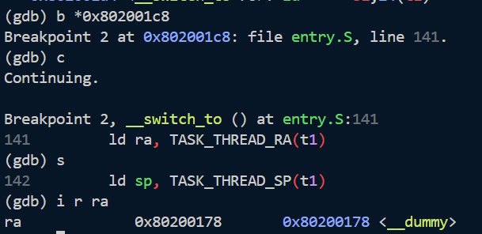
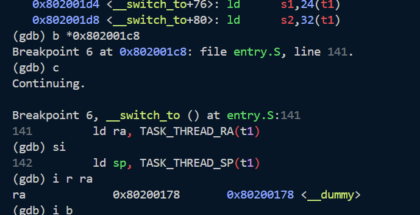
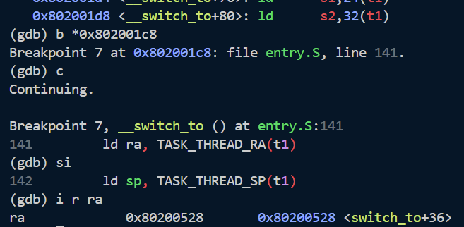
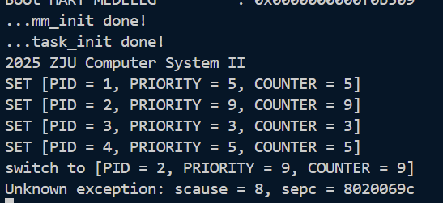
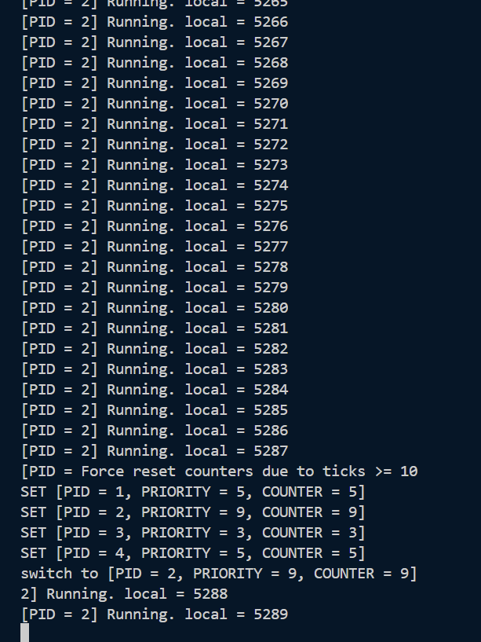

# Lab 6 实验报告

## 1 实验目的
了解线程概念以及如何使用时钟中断来进行线程调度。
了解线程切换原理并实现线程切换。

## 2 试验过程

#### 问题 1：执行`make run`的输出与文档不一致
**解决方案**：最开始不一致是出发了异常：
```bash
2025 ZJU Computer System II
[S] Supervisor timer interrupt
Unknown exception: scause = 5, sepc = 8020052c
```
这是因为我没有调用`task_init`函数（但是文档也没写啊qaq）。
修改后出现第二次不一致，输出变成：
```bash
...mm_init done!
...task_init done!
2025 ZJU Computer System II
[S] Supervisor timer interrupt
SET [PID = 1, PRIORITY = 5, COUNTER = 5]
SET [PID = 2, PRIORITY = 9, COUNTER = 9]
SET [PID = 3, PRIORITY = 3, COUNTER = 3]
SET [PID = 4, PRIORITY = 5, COUNTER = 5]
switch to [PID = 2, PRIORITY = 9, COUNTER = 9]
[PID = 2] Running. local = 1
[S] Supervisor timer interrupt
[PID = 2] Running. local = 2
[S] Supervisor timer interrupt
[PID = 2] Running. local = 3
[S] Supervisor timer interrupt
[PID = 2] Running. local = 4
```
即每次时钟中断都会输出`[S] Supervisor timer interrupt`，而文档中没有。把这行打印语句注释掉即可。（但是文档里也没写呀qaq）

最终效果：

与文档完全一致。


## 3 思考题

#### 1.  在 RV64 中共有 32 个通用寄存器，为什么 `__switch_to` 中只需保存 14 个？
`sp`、`s0-s11`属于Callee-saved寄存器，`__switch_to`作为被调用者需要保存他们。`ra`寄存器保存了`__switch_to`的返回地址，也需要保存（否则切换回这个线程的时候会跳转到错误地址）。其他寄存器如`a0-a7`、`t0-t6`属于Caller-saved寄存器，不需要保存，因为调用者负责保存它们的值。
因此只需要保存`sp`、`s0-s11`和`ra`，共14个寄存器。

#### 2. 线程间什么是共享的，什么是独有的？具体体现在本次实验中是哪些？
- **共享**：
    - 虚拟地址空间：包括代码段、数据段和堆栈段。所有线程共享同一个内核地址空间。
    - 打开的文件
    - 信号处理函数、PID等
- **独有**：
    - 栈：每个线程都有独立的栈空间
    - 线程上下文：包括PC、SP、通用寄存器、状态寄存器等
    - 线程属性：如线程ID、优先级、时间片等

**在本次实验中**：
- **共享**：
    - 内核代码：所有线程都运行在同一个内核代码段中
    - 全局变量：比如`proc.c`中定义的`task`数组、`current`指针、`idle`指针等
    - 内核地址空间
- **独有**：
    - 线程栈：在`task_init`中为每个线程分配独立的栈空间
    - 线程上下文：在`struct thread_struct`中保存每个线程的`ra`、`sp` 和 `s0-s11`寄存器值
    - 线程属性：如`task_struct`中的`pid`、`priority`、`counter`等

#### 3. 当线程第一次调用 `__switch_to` 时，其 `ra` 寄存器恢复的返回地址是 `__dummy`。线程在之后对 `__switch_to` 的调用中，`ra` 寄存器保存 / 恢复的函数返回地址是什么呢？请使用 gdb 追踪一次完整的线程切换流程（附上你认为关键的截图），并特别关注 `pc`、`ra` 寄存器、`sepc` CSR 的变化。
在第一次执行到`__switch_to`入口处时`pc`、`ra`和`sp`的值如下图所示：

`pc`指向`__switch_to`函数的入口地址。
当线程第一次调用 `__switch_to` 时，其 `ra` 寄存器恢复的返回地址是 `__dummy`。

第一次调用`__switch_to`是从idle线程切换到PID=2的线程，`ra`寄存器保存了`__dummy`的地址。
之后依次切换到PID=1、4、3，的线程时`ra`都是`__dummy`的地址。

当线程切换回PID=2时，`ra`恢复为`switch_to+36`，即上次从PID=2切换出去时（`switch_to+32`）的下一条指令地址（+4）。


#### 4. 尝试回答这些问题。第 2 题的结果对这些问题应当很有帮助：

##### a. 为什么在 `__dummy` 中使用 `#!asm sret` 而不是 `#!asm ret`？
`__dummy`的实现方式是
```asm
__dummy:
    # 1. 将 dummy_task 的地址加载到 t0
    la t0, dummy_task

    # 2. 将 t0 的值写入 sepc 寄存器
    csrw sepc, t0

    # 3. 使用sret跳转到 dummy_task
    sret
```
将`sepc`设置为`dummy_task`的地址，使用`sret`指令跳转到`sepc`指向的地址。而`ret`指令是跳转到`ra`指向的地址，与涉及不符。
而且`sret`会将`sstatus`寄存器的SIE位恢复，重新开启中断，使系统能够进行后续的调度。如果使用`ret`，则无法重新触发中断，无法进行后续的调度。

##### b. 为什么在 `__switch_to` 中使用 `#!asm ret` 而不是 `#!asm sret`？
`__switch_to`函数是被c语言函数`switch_to`调用的，它的返回地址保存在`ra`寄存器中，所以需要使用`ret`指令跳转到。
`sret`指令用于跳转到`sepc`指向的地址，会直接跳过`switch_to`函数的返回地址，导致程序无法正确返回到调用`switch_to`的地方。


##### c. 为什么我们不直接在 `start_kernel` 中调用 `schedule` 进行调度，而是要把这件事交给第一次时钟中断呢？请尝试直接调用 `schedule` 观察现象。在中断发生时，有哪些重要的 CSR 发生了变化？
线程调度需要依赖中断机制来保存上下文，如果在`start_kernel`中直接调用`schedule`，会导致当前线程的上下文没有被保存。

中断发生时，以下CSR会发生变化：
- `sepc`：保存中断发生时的程序计数器（返回地址）
- `scause`：保存中断的原因
- `sstatus`：保存中断前的状态寄存器

如果直接调用`schedule`，会导致这些CSR没有被正确设置，引起异常。

`scause = 8` 代表 **Environment call from U-mode**（用户态环境调用）
直接调用`schedule`会导致`sstatus`没有被正确设置，然后`sret`会返回U态，然后再执行`ecall`时就会触发权限异常。

#### 5. `dummy_task` 的注释中提到了 `priority` 为 1 时的特殊情况。请解释为什么 `priority` 为 1 时，如果去除对 `counter` 的特殊处理，会导致信息无法打印（即，为什么线程可见的 `counter` 永远为 1）？
如果`priority`为1时不进行特殊处理，`current->counter`会被设置为1，中断发生时，`do_timer`会将`current->counter`减1，变为0，然后调用`schedule`进行调度。`schedule`发现counter为0，会重新设置`counter`为`priority`的值，即1。这样每次中断后，`counter`都会被重置为1，导致线程看到的`counter`永远是1。`dummy_task`看不到`counter`的变化（`current->counter != prev_cnt`始终为假），因此无法打印信息。

#### 6. 阅读并理解 `arch/riscv/kernel/mm.c`。为什么在[准备工程](#_8)中，我们不能直接将 `sp` 设置为 `_ekernel` 加上 4 KiB 偏移量？实际上，如果仍然保持这种设置方式，会发现内核无法正常启动。你的回答应当能够解释这一现象。
如果仍然保持这种方式，内核启动时的栈空间位于`[_ekernel, _ekernel + 4KiB)`，然后调用`mm_init`函数会将`_ekernel`之后直到`PHY_END`的物理内存初始化，这个过程会覆写刚才分配的栈空间，导致`mm_init`函数的栈空间被破坏（比如返回地址被`memset`覆写为`0xfa`），从而导致内核无法正常启动。

lab6链接示意图：
```
┌──────────────┐◄─── _skernel, _start, 0x80200000
│ .text        │
├──────────────┤
│ .rodata      │
├──────────────┤
│ .data        │
├──────────────┤
│ .bss.stack   │
│ (4KiB)       │
├──────────────┤◄─── _sbss (sp 初始值)
│ .bss         │
├──────────────┤◄─── _ekernel
│              │
│  Free Memory │ <--- mm_init 初始化的区域
│     ...      │
└──────────────┘
```


#### 7. 为什么线程的切换要在S态进行而不能在U态进行，如果在U态会有什么后果？
- 原因：
    1. 权限限制：线程切换涉及对CPU状态的保存与恢复，需要访问特权寄存器（如`sstatus`）和执行特权指令（如`sret`）。U态没有足够的权限来执行这些操作。
    2. 内核内存保护：线程的上下文（`thread_struct`）、内核栈等结构储存在内核空间的内存中。为了系统安全，U态程序无法直接访问内核空间的内存。
    3. 中断控制：线程切换通常发生在系统调用或中断处理过程中，这些操作都在S态下进行。
- 后果：
    1. 权限错误：如果尝试在U态进行线程切换，会因为权限不足而导致异常或错误。
    2. 系统崩溃：由于无法正确保存和恢复线程上下文，可能导致系统状态混乱，最终导致系统崩溃。
    3. 安全漏洞：如果U态程序能够进行线程切换，可能会导致恶意程序修改调度逻辑，剥夺其他线程的执行机会。

#### 8. 我们本次lab是在所有线程的时间片都消耗为`0`后再进行设置和调度，如果我们改成每运行减少10次之后就重新设置与调度。会出现什么问题？
如果改成每运行减少10次之后就重新设置与调度，`priority`大的线程的`counter`会优先减小然后再充满，导致系统一直运行高优先级的线程，`priority`小的线程可能长时间得不到调度机会。

#### 9. （bonus）试着按照思考题8的问题修改你的代码，用运行结果来展示你上一条的答案（本bonus仅在本次实验中有效，不会溢出到其他实验）

如图所示，PID=2的线程（优先级最高）一直在运行，在时间片减小10次重新设置和调度的情况下，运行的仍然是PID=2的线程，其他线程没有机会运行。

#### 10. 本次实验是最后一次软件实验，你有什么想说的话吗，不记录分数，纯属用于吐槽，可以是助教工作，实验设计，实验流程，实验环境等等。
思考题好多。这个问题和心得体会是不是有点重复？


## 4 心得体会
见思考题10。