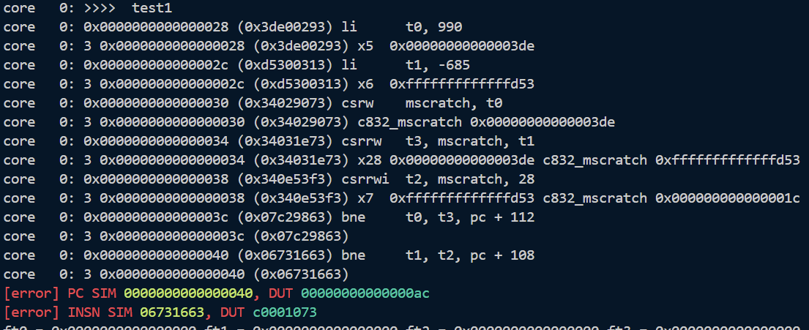
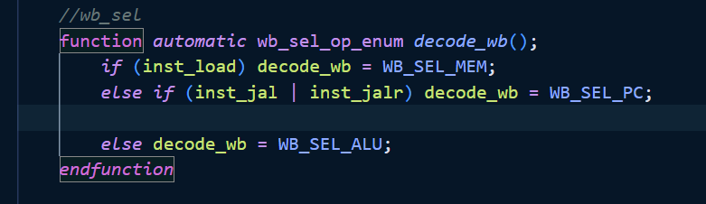
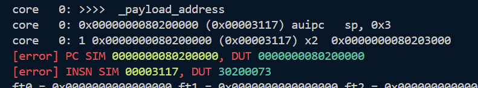
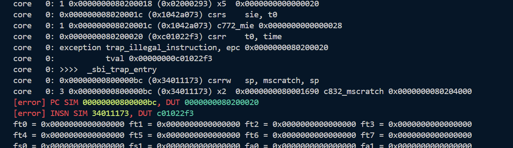
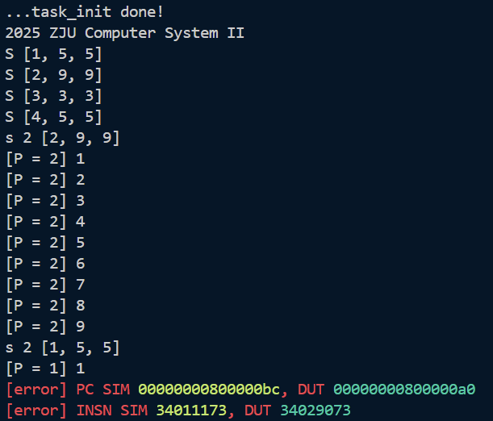
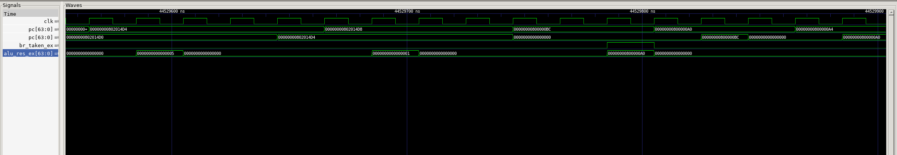
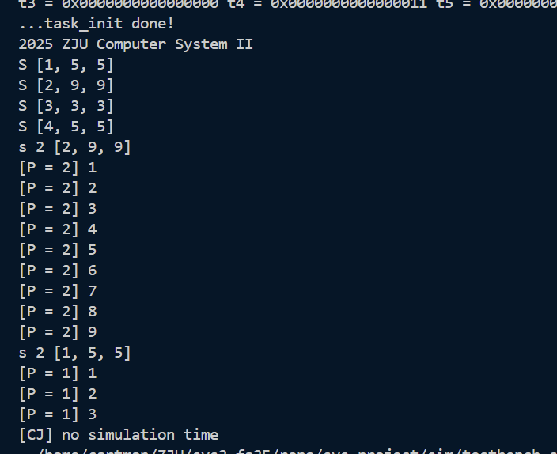

# Lab 7 实验报告

## 1 实验目的
完善CPU并运行自己编写的内核。

## 2 试验过程

#### 问题 1 运行test1时`csrrw t3, mscratch, t1`指令无法正确写入`t3`，导致后续`bne`指令错误跳转

**解决方案**：原因是在`Controller.sv`中没有正确设置CSR指令的写使能信号`csr_we`，导致CSR寄存器无法写入数据。并且忘记修改`wb_sel`信号译码逻辑，导致`wb_sel`信号没有被设置为CSR寄存器读出的数据。

在代码中添加一行`else if (inst_csr && funct3 != 3'b000) decode_wb = WB_SEL_CSR;`，并且在默认值中添加`ctrl_signals.csr_we = decode_csr_we();`

此外，原本的`controller`模块中`we_reg`信号并没有在`opcode==OPCODE_CSR`时置高，导致csr指令无法向通用寄存器写入数据。因此做如下修改：

```verilog
ctrl_signals.we_reg  = (inst_reg | inst_load | inst_imm | inst_auipc | inst_lui | inst_regw | inst_jal | inst_jalr |
                                inst_immw | (inst_csr && funct3 != 3'b000));
```

#### 问题 2 如下图

在执行`mret`后，pc已经正确更新为`0x80200000`，但是inst仍然是`0x30200073`，出现取指过时。
**解决方案**：出现这个问题是因为流水线寄存器的`valid`信号没有考虑`switch_mode`的影响，添加以下逻辑问题得到解决：
```verilog
    logic discard_next_fetch;
    
    always_ff @(posedge clk) begin
        if (rst) begin
            discard_next_fetch <= 1'b0;
        end else begin
            if (switch_mode || br_taken_ex) begin
                // 如果正在等待响应 (IF2/WAITFOR2) 且响应还没到，或者正在发送请求 (IF1/WAITFOR1) 且请求已发出
                if ((current_state == IF2 || current_state == WAITFOR2) && !(imem_ift.r_reply_valid && imem_ift.r_reply_ready)) begin
                    discard_next_fetch <= 1'b1;
                end else if ((current_state == IF1 || current_state == WAITFOR1) && imem_ift.r_request_valid && imem_ift.r_request_ready) begin
                    discard_next_fetch <= 1'b1;
                end
            end else if (imem_ift.r_reply_valid && imem_ift.r_reply_ready) begin
                // 当响应到达时，清除丢弃标记
                discard_next_fetch <= 1'b0;
            end
        end
    end

    assign if_id_reg_in.valid      = imem_ift.r_reply_valid & imem_ift.r_reply_ready & ~discard_next_fetch;
```

#### 问题 3 如下图

执行`0x0000000080200020 (0xc01022f3) csrr    t0, time`时，应当进入trap处理，因为我们的仿真框架在S态下无法读取`time`寄存器。但是dut并没有进入trap处理。
**解决方案**：没理解到实验文档的意思，我还以为要自己处理这个异常，实际上除了修改`clock.c`，还需要将`head.S`中的`rdtime`注释掉。

#### 问题 4
仿真多次输出
```verilog
[error] 00000000802000d0@10002373 CSR UNMATCH SIM 0000000200000120, DUT 0000000000000120 
```
**解决方案**：这是因为Spike模拟器默认实现了 UXL 字段（User XLEN），对于 64 位架构，该字段通常为 2。
而 CSRModule.sv 中 sstatus 的将其设置为 0。
```verilog
wire [63:0] sstatus={55'b0,spp_reg,2'b0,spie_reg,upie_reg,2'b0,sie_reg,uie_reg};
```
将其修改为
```verilog
wire [63:0] sstatus={30'b10, 23'b0,spp_reg,2'b0,spie_reg,upie_reg,2'b0,sie_reg,uie_reg};
```

#### 问题 5 如下图

程序进入`0x800000bc`后pc没有正藏递增，而是变成了`0x800000a0`，导致仿真出错
**解决方案**：

如图，`br_taken_ex`错误地被设置为1，导致pc跳转到错误的地址`alu_res_ex`。
在`pc=0x802014d4`后，程序应该进入`trap_entry:0x800000bc`，但是`inst`会根据`0x802014d8`取到`fed702e3`，这是一条beq指令，导致了刚才提到的错误跳转。
修改的重点是防止错误读取的`inst`对`npc_sel`的影响，所以做如下修改：
```verilog
    assign id_ex_reg_in.npc_sel     = if_id_reg_out.valid ? ctrl_signals_id.npc_sel : NPC_SEL_PC;
```
最终得到正确输出：


## 3 思考题

#### 1.  使用 `printk` 函数输出一个字符 `a` 的过程中需要发生几次特权态切换？请将切换前后的特权态和切换的原因一一列举出来。
发生2次特权态切换：
1. S -> M：在执行`printk`前，特权态为S态，执行`printk`时会调用sbi接口来向控制台输出字符，这一步是通过`ecall`实现的，在S态执行`ecall`会触发Environmental Call from S-mode异常，使CPU切换到M态来处理该异常。
2. M -> S：在M态处理完`ecall`异常后，CPU会通过`mret`指令返回到之前的S态（`mepc`指向的地址）继续执行`printk`函数后续的代码。

#### 2. 如果流水线的 IF、ID、MEM 阶段都检测到了异常发生，应该选择哪个流水级的异常作为 trap_handler 处理的异常? 请说说为什么这么选择。
应当选择MEM阶段的异常，理由如下：
1. 按照指令进入流水线的顺序，MEM阶段的指令比IF、ID阶段的指令更早进入流水线，因此MEM阶段的异常更早发生，优先处理（按照现有的设计，`CSRModule`在WB阶段接收异常信息`except_commit`决定是否触发`switch_mode`，而MEM阶段的指令更早进入WB）。
2. 如果优先处理IF或ID阶段的异常，会导致MEM阶段的异常被跳过，违反了原本的执行顺序。
3. 选择MEM阶段的话，会使IF、ID阶段的流水线寄存器被flush，从而避免了后续指令继续执行可能引发的更多异常。

#### 3. 现在你能够在你自己设计的 CPU 上运行你自己编写的操作系统内核了，这给你带来了很大的自由度，你可以做到很多你直接在自己的电脑上编程可能做不到的事情。你想挑战在你的最小系统上实现什么？无需真的实现，给出大致思路即可。
可以为特定的运算设计专门的指令集扩展，比如为矩阵乘法运算设计专门的指令（lab4添加独立于cpu的卷积加速器也可实现）：
1. 更改ISA，为新的矩阵乘法指令定义`opcode`和`funct`字段。
2. 在`Controller.sv`中添加对新指令的译码逻辑，生成相应的控制信号。
3. 在`core.sv`中添加计算矩阵乘法的硬件单元，完善数据通路，在执行阶段调用该单元进行计算。
4. 在操作系统内核中编写内联汇编函数来封装这条指令。
5. 在`trap_handler`中处理可能出现的异常情况，比如矩阵维度不匹配等。


#### 4. 可以为系统 II 的课改留下任何宝贵的心得体会和建议吗? 不记录分数，纯属用于吐槽，可以是助教工作、实验设计、实验流程等等，什么都行。
终于结束了。。。这次综合实验的文档写得貌似没有之前详细，没有对于预期输出的展示。

## 4 心得体会
下学期没选sys3，要和计算机系统say goodbye了。